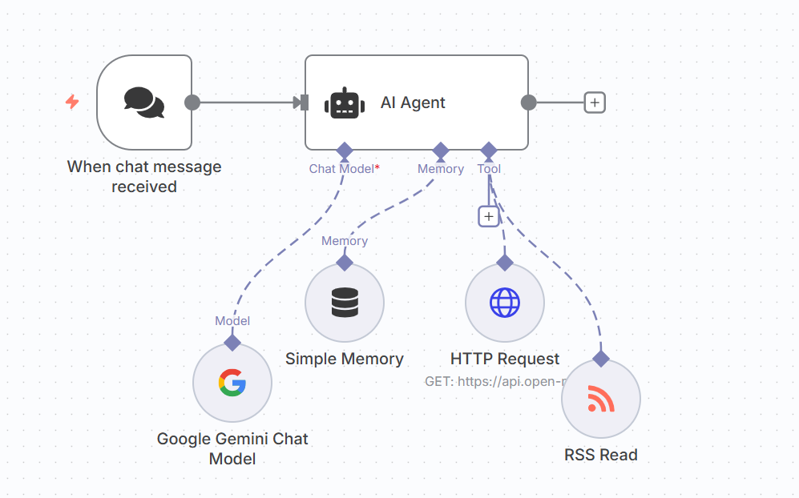

# Real-time Information Agent

This project is a conversational AI agent built in n8n that can provide live information by fetching and processing data from external sources. It is equipped with tools to read news from any RSS feed and get current weather data for any location.

## Key Features

- **RSS Feed Integration:** Can be given any RSS feed URL to fetch and summarize the latest posts.
- **Live Weather Data:** Uses an HTTP Request to connect to a weather API, providing up-to-date forecasts.
- **Conversational Memory:** Remembers the context of the conversation for a more natural interaction.
- **Natural Language Understanding:** Powered by Google Gemini to understand user requests for news or weather.

## Technologies Used

- **n8n** for workflow automation
- **Google Gemini Pro** as the core LLM
- **REST APIs** (via HTTP Request node) for weather data

## How to Use

1.  Download the `information-agent-workflow.json` file from this repository.
2.  Import the JSON file into your n8n instance.
3.  Add your own credentials for the Google Gemini and HTTP Request nodes.
